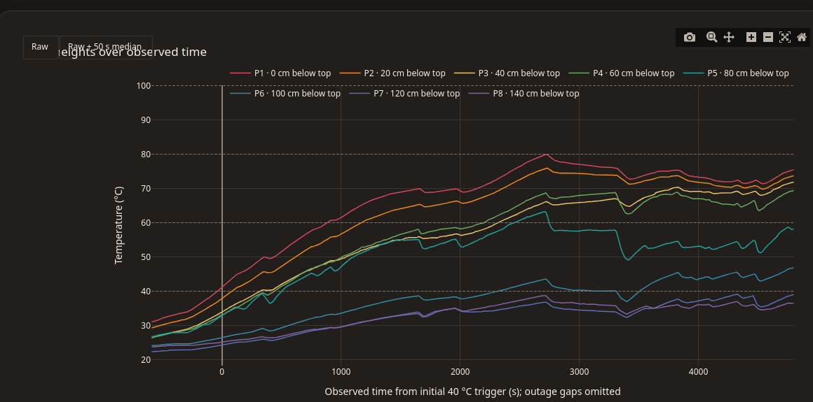

# Sauna temperature measurement

Power-loss-resilient session logger for a Seeed Studio XIAO ESP32-C3 and eight
powered DS18B20 temperature sensors. Wi-Fi is disabled. Measurements are
available over USB, while detected sauna sessions are stored in internal flash.

The repository contains the embedded logger, USB extraction tools, CRC-safe log
parser, and self-contained interactive analysis reports. Development invariants
and verification commands for coding agents are summarized in `AGENTS.md`.

An anonymized first full sauna run is retained as a reproducible example. See
[`docs/runs/2026-08-16-session-1.md`](docs/runs/2026-08-16-session-1.md) for the
observations and commands used to regenerate its CSV and interactive report.

[](docs/runs/2026-08-16-session-1.md)

## Wiring

The firmware uses XIAO pin `D2` for the 1-Wire data line. Connect every sensor
in powered (three-wire) mode:

- sensor GND to XIAO GND
- sensor VDD to XIAO 3V3
- sensor DATA to XIAO D2
- 4.7 kOhm pull-up from DATA to 3V3 as an initial value

Prefer a linear trunk with short sensor branches. Do not use parasite power.
The final pull-up value may need adjustment for the installed cable length and
topology.

## Commands

PlatformIO is installed in the repository-local Python virtual environment.

```sh
.venv/bin/pio run
.venv/bin/pio run --target upload
.venv/bin/pio device monitor
```

Exit the serial monitor with `Ctrl-C`.

Install the optional offline-analysis dependency once:

```sh
.venv/bin/pip install -r requirements-analysis.txt
```

## Commission the probes

The firmware is generic: it contains no installation-specific probe addresses.
On the first boot of this version, on a new device, or after NVS has been
erased, probe discovery and fresh temperature scans remain available over USB
but session logging is disabled until all eight probes have been mapped. Probe
identity always comes from the DS18B20 ROM address, never from discovery order.

The default commissioning method is to connect the probes one at a time,
starting with probe 1 at the top/farthest end and finishing with probe 8 at the
bottom/nearest end:

```sh
.venv/bin/python tools/identify_sensors.py --method connect
```

If an assembled harness cannot be disconnected, connect all eight probes and
use the warm-one-at-a-time method instead:

```sh
.venv/bin/python tools/identify_sensors.py --method warm
```

The tool validates every ROM's family and Maxim CRC, requires eight unique
addresses, and confirms that the final discovered set exactly matches the
proposed map. It stages the complete map in RAM, writes a CRC-protected record
to the inactive NVS slot, reads it back, and then reboots into that generation.
After reconnecting, it verifies that boot activated that exact generation and
that the same eight ROMs are still present. The previous valid slot is never
erased during a normal commit. Partial identification progress is saved to
`sensor-map.pending.json`, so an interrupted replacement cannot overwrite the
last verified `sensor-map.json`. The final map replaces `sensor-map.json`
atomically only after all post-reboot checks pass.

Commissioning does not format LittleFS or alter existing `.slog` files.
`LOG FORMAT YES` likewise leaves the probe mapping in NVS intact. A full-chip
erase does remove the mapping, so keep `sensor-map.json` as a backup. The
line-oriented protocol intended for both this tool and the browser portal is
documented in
[`docs/probe-commissioning.md`](docs/probe-commissioning.md).

The browser portal installs its own versioned, SHA-256-checked firmware package,
verifies the running logger, and commissions a fully assembled eight-probe
column by warming one metal tip at a time. The secondary bench method still
supports connecting probes individually. It verifies the committed map after
restart and creates a local `sensor-map.json` backup. The static utility is
designed for GitHub Pages and remains available offline after its files have
been cached. It has no arbitrary firmware picker or whole-flash erase option.
See [`docs/web-commissioning-portal.md`](docs/web-commissioning-portal.md) for
browser requirements, recovery behavior, local serving, and deployment.

## Session logging

- Samples are taken every 10 seconds.
- No session can start without one complete, valid eight-probe configuration.
- The latest 10 minutes are retained in RAM while idle.
- A session starts after any valid probe remains above 40 C for 30 seconds.
- The pre-trigger readings are committed immediately; later blocks are flushed
  every 10 minutes, limiting sudden-power-loss exposure to the current block.
- A normal session ends after the hottest probe remains below 45 C and at least
  15 C below the session peak for 30 minutes. Probe 1 and at least six probes
  must be healthy for automatic ending.
- Logs use CRC-protected binary blocks. An absent footer marks a power-cut
  session; valid committed blocks remain downloadable.
- Every 10-minute block is opened, appended, flushed, and closed independently.
  An unexpected power cut can therefore lose or corrupt only the block being
  assembled or written; the offline parser stops at the first incomplete or
  invalid block and preserves all earlier blocks.
- If power returns while the sauna is still hot, the new session records the
  interrupted session ID as a probable continuation. A cold reading from at
  least six probes cancels that link.
- Device flash is a bounded rolling store, not the permanent archive. Immediately
  before opening a new session, the logger requires enough free space for a full
  12-hour recording. If necessary, it may retire the oldest eligible completed
  logical run to make that reserve. Segments linked by continuation metadata are
  treated as one run, and an interrupted session that may be continued is
  protected.
- Linked segments are retired newest first. If power fails between removals,
  the remaining files are still a valid prefix and the same run is completed
  immediately before the next session starts.
- Retention never runs during an active session. If the full-session reserve
  cannot be made from eligible completed runs, the new session is refused and
  every existing raw log is left in place.
- The firmware records boot/reset metadata, RTC source and fallback state,
  sensor-health flags, and the ESP32-C3's internal temperature alongside probe
  readings. Wi-Fi remains disabled.

The flash filesystem is never formatted automatically. After installing the
logging firmware for the first time, initialize it explicitly:

```sh
.venv/bin/python tools/logs.py format --yes
```

Inspect and retrieve sessions over USB:

```sh
.venv/bin/python tools/logs.py status
.venv/bin/python tools/logs.py list
.venv/bin/python tools/logs.py download 1 session-1.slog
.venv/bin/python tools/logs.py export session-1.slog session-1.csv
.venv/bin/python tools/logs.py plot session-1.slog session-1.html
.venv/bin/python tools/logs.py report session-1.slog
```

The `plot` result is a self-contained interactive HTML report: it includes raw
and optional 50-second-median traces, a time/height thermal map, hover-linked
vertical profiles, stratification analysis, threshold timing, rapid-warming
candidates, and logger-health information. It works without a network or local
server. When related `.slog` files are in the same directory, continuation
links are followed automatically and unknown power-off intervals are shown as
explicit breaks. Use `--no-chain` to inspect one physical file alone.

Compare complete runs, aligned at their 40 C triggers, with:

```sh
.venv/bin/python tools/logs.py compare session-1.slog session-8.slog \
  --output comparison.html
```

Comparison reports provide a selector for all eight probe heights, shared-scale
thermal maps, and a compact outcome table. Every report embeds its plotting
code and can be archived alongside the original logs.

`status` reports filesystem health, whether the full reserve is currently free,
retention counts and any pending retirement, probe-configuration state and
generation, discovered and currently valid mapped probes, the latest sensor and
internal-chip temperature, RTC source, reset cause, interrupted-session state,
and whether a crash dump is present. Retention and a low-space start refusal are
also reported over USB. There is currently no standalone LED warning, so an
unattended refusal is only visible after USB is reconnected; run `status` before
any measurement that must not be missed.

If a watchdog crash occurred, preserve the raw dump before erasing it:

```sh
.venv/bin/python tools/logs.py crash-download crash.bin
.venv/bin/python tools/logs.py crash-erase
```

The raw crash dump can later be decoded with the matching ESP-IDF tools and
firmware ELF. The task watchdog, brownout detector, and flash core dumps are
enabled in the build. ESP-IDF falls back if XTAL32K cannot start; ESP32-C3 does
not provide ESP-IDF's separate crystal-failure watchdog, so the logger samples
the active RTC source continuously and records any fallback for later review.

Downloading neither removes the device copy nor marks it as archived. Because
the logger cannot know whether a completed run has been copied elsewhere,
download and CRC-validate raw `.slog` files regularly, ideally after every
measurement. Automatic retention may eventually retire an old completed run.
Manual deletion remains available when you have already preserved every linked
segment of that logical run. Delete a linked run newest segment first; firmware
refuses to delete a segment while another on-device session points to it:

```sh
.venv/bin/python tools/logs.py delete 1
```

The portal's **Records** section provides the guarded browser equivalent: it
shows the rolling-store reserve and logical chains, supports CRC-validated raw
downloads, and authorizes whole-run removal only after every segment has been
saved and read back through the file-system picker. **Analyze** opens one or
more `.slog` files entirely offline, groups only unambiguous continuations, and
shows an eight-probe SVG timeline with explicit unknown-duration gaps. The
selected run can be exported as CSV or as an Excel `.xlsx` workbook; both keep
segment-relative time and mark unknown power gaps instead of inventing elapsed
time. See
[`docs/web-data-workspace.md`](docs/web-data-workspace.md) for the preservation
and deletion gates and the export schema.

## Installation geometry

Probe 1, at the end opposite the ESP32, is the highest probe near the ceiling.
Probes increase in number downward toward the ESP32 at 20 cm intervals. Probe 8
is therefore 140 cm below probe 1. These are relative heights; an absolute
ceiling or floor height can be added later without changing sensor identity.

## Unattended sauna test checklist

1. Build and upload the firmware, commission the probes if needed, then run
   `status` and confirm a valid configuration, all eight probes, `RTC source:
   external crystal`, and that the full-session storage reserve is ready.
2. Download any sessions not already backed up. Keep the XIAO and wiring in the
   coolest practical location; keep the USB power bank outside the sauna.
3. Disconnect serial, power from the power bank, and let the firmware start the
   session automatically after a probe stays above 40 C for 30 seconds.
4. Unannounced power removal is supported. On the next USB connection, run
   `status`, `list`, download every relevant `.slog`, and also download a crash
   dump if one is reported.
5. Run `report`, export CSV, and generate the HTML plot before deleting anything
   from the device. Retain the original `.slog` files for later analysis.
